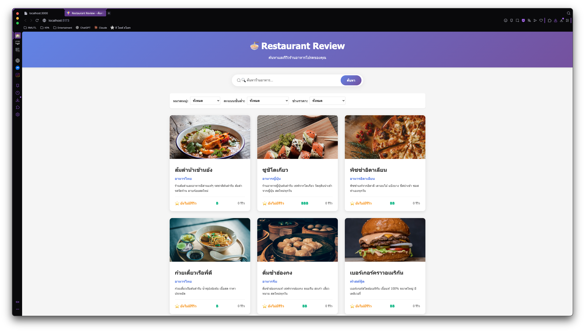

# 🍽️ Restaurant Review App

เว็บแอปร้านอาหารที่ผู้ใช้สามารถค้นหา ดูรายละเอียด และรีวิวร้านอาหารได้แบบเรียลไทม์  
สร้างขึ้นด้วย **React + Vite** (frontend) และ **Express.js + JSON File Storage** (backend)

---

## 🚀 Features

### 👩‍🍳 ฝั่งผู้ใช้ (Frontend)
- 🔍 ค้นหาร้านอาหารด้วยชื่อหรือหมวดหมู่  
- 🎚️ กรองตามประเภทอาหาร, ระดับราคา, หรือคะแนนรีวิว  
- 💜 หน้ารายละเอียดร้าน (ชื่อ, รูปภาพ, รีวิว, คะแนนเฉลี่ย)  
- 🧾 เพิ่ม/แก้ไข/ลบ รีวิว ได้ (จำลองการทำงานโดยเก็บข้อมูลในไฟล์ JSON)
- ✨ ดีไซน์ทันสมัยด้วย React + Tailwind CSS  
- 📱 รองรับ Responsive ทั้งมือถือและ Desktop  

### ⚙️ ฝั่งผู้ดูแล (Backend)
- 📦 REST API สำหรับอ่าน / เขียน / ลบข้อมูลร้านอาหารและรีวิว  
- 🗂️ ใช้ไฟล์ `restaurants.json` เป็นฐานข้อมูลจำลอง (JSON File Storage)
- 🧩 ใช้ Express.js และ Middleware มาตรฐาน  
- ✅ รองรับ CORS และ JSON body parsing  

---

## 🏗️ Project Structure

```
restaurant-review-app/
│
├── backend/ # ฝั่งเซิร์ฟเวอร์ Express.js
│ ├── routes/
│ │ └── restaurants.js
│ ├── data/
│ │ └── restaurants.json
│ ├── utils/
│ │ ├── readJsonFile.js
│ │ └── writeJsonFile.js
│ ├── server.js
│ └── package.json
│
├── frontend/ # ฝั่งผู้ใช้ React + Vite
│ ├── src/
│ │ ├── components/
│ │ │ ├── RestaurantList.jsx
│ │ │ ├── RestaurantCard.jsx
│ │ │ ├── RestaurantDetail.jsx
│ │ │ ├── SearchBar.jsx
│ │ │ └── FilterPanel.jsx
│ │ ├── services/
│ │ │ └── api.js
│ │ ├── App.jsx
│ │ └── main.jsx
│ ├── public/
│ ├── index.html
│ ├── vite.config.js
│ └── package.json
│
└── README.md
```

---

## ⚙️ Installation & Setup

### 1️⃣ Clone โปรเจกต์
```bash
git clone https://github.com/USERNAME/restaurant-review-app.git
cd restaurant-review-app
```

### 2️⃣ ติดตั้ง dependencies
#### Backend
```bash
cd backend
npm install
```

#### Frontend
```bash
cd ../frontend
npm install
```

---

### 🧠 การรันโปรเจกต์
#### ✅ รัน Backend (Port 3000)
```bash
cd backend
npm run dev
```

#### ✅ รัน Frontend (Port 5173)
```bash
cd frontend
npm run dev
```

---

### 🧪 ตัวอย่าง API
#### 🔹 GET /api/restaurants
```bash
curl http://localhost:3000/api/restaurants
```

#### 🔹 POST /api/restaurants/:id/reviews
```bash
curl -X POST http://localhost:3000/api/restaurants/1/reviews \
  -H "Content-Type: application/json" \
  -d '{"user":"Sara","rating":5,"comment":"อาหารอร่อยมาก"}'
```

---

### 🖼️ ตัวอย่างหน้าจอ
| หน้า              | ตัวอย่าง                         |
| ----------------- | -------------------------------- |
| 🏠 หน้ารวมร้าน    | 🔍 ช่องค้นหากลางหน้า + การ์ดร้าน |
| 🧾 หน้ารายละเอียด | แสดงข้อมูลร้าน + รีวิวจากผู้ใช้  |
| ✏️ เพิ่มรีวิว     | ฟอร์มเพิ่มรีวิวแบบเรียลไทม์      |



---

### 💡 การออกแบบเพิ่มเติม
- Search Bar มีเอฟเฟกต์ gradient และไอคอน 🔍
- ปุ่ม “ค้นหา” มี animation hover สวยงาม
- Responsive ทุกอุปกรณ์
- ใช้ `lucide-react` สำหรับชุดไอคอน

---

### 🧰 Tech Stack
| ส่วน     | เทคโนโลยี                                  |
| -------- | ------------------------------------------ |
| Frontend | React 18, Vite, Tailwind CSS, lucide-react |
| Backend  | Node.js, Express.js                        |
| Database | JSON File Storage                          |
| Tools    | Postman, VS Code, GitHub                   |

---

### 🏁 การส่งงาน
1. Push โค้ดทั้งหมดขึ้น GitHub
2. ตรวจให้แน่ใจว่า `backend/` และ `frontend/` รันแยกกันได้
3. ส่งลิงก์ GitHub Repository หรือไฟล์ `.zip` ตามที่อาจารย์กำหนด

---

### ✨ ผู้จัดทำ
นางสาวสาริศา ถวัลย์วราศักดิ์   
รหัสนักศึกษา 67543210005-4   
รายวิชา ENGSE203 – Software Engineering   
